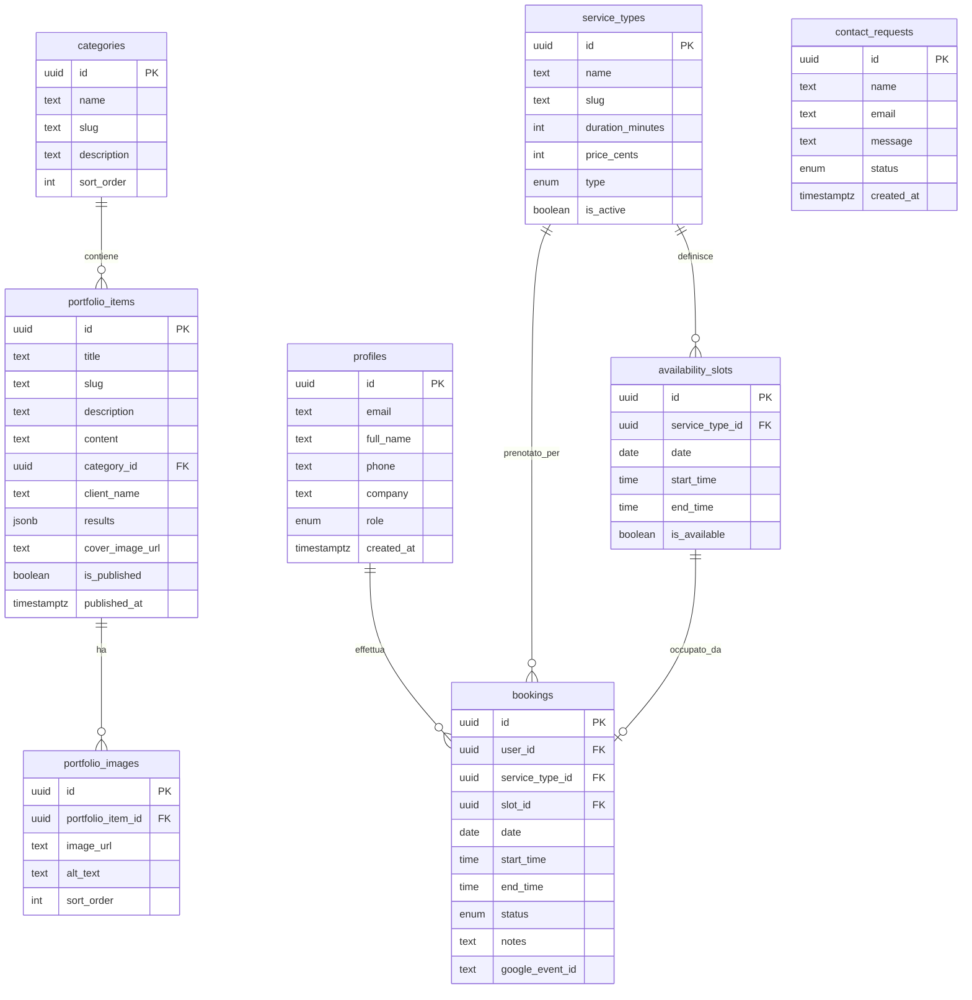
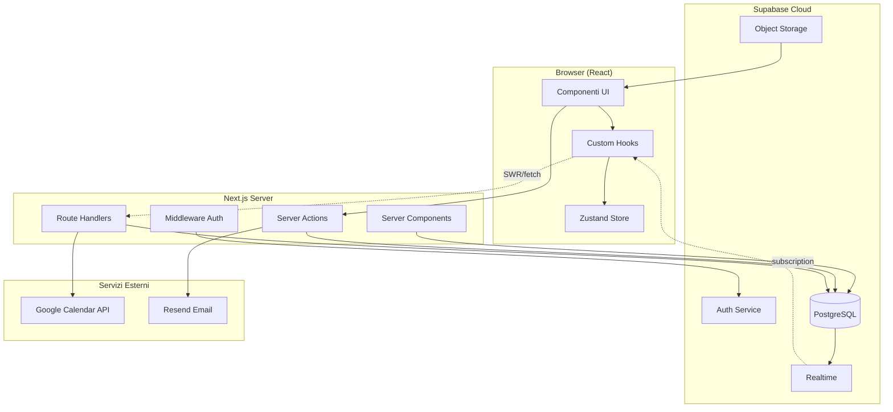
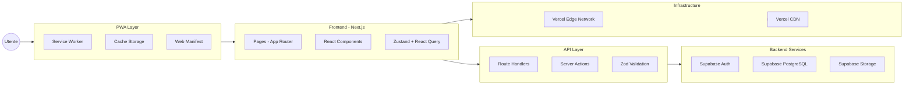

# Architettura MVP — SocialMediaReggioEmilia.it

> Documento di riferimento architetturale per la Progressive Web App del brand di social media marketing a Reggio Emilia.

---

## Indice

1. [Tech Stack Raccomandato](#1-tech-stack-raccomandato)
2. [Schema Database](#2-schema-database)
3. [Architettura Componenti](#3-architettura-componenti)
4. [Task Decomposition MVP](#4-task-decomposition-mvp)
5. [API Design](#5-api-design)

---

## 1. Tech Stack Raccomandato

### Frontend

| Layer | Tecnologia | Motivazione |
|-------|-----------|-------------|
| Framework | **Next.js 14+** (App Router) | SSR/SSG ibrido, Server Components, ottimizzazione immagini built-in, deploy su Vercel zero-config |
| UI Library | **React 18** | Concurrent features, Suspense per loading states |
| Styling | **Tailwind CSS 3.4+** | Utility-first, design system coerente, purge automatico, ottimo per design minimalista |
| Component Library | **Radix UI** (primitives) | Accessibilità WCAG 2.1 out-of-the-box, unstyled, composabile con Tailwind |
| State Management | **Zustand** | Leggero (~1KB), API minimale, nessun boilerplate, perfetto per stato UI locale |
| Form Handling | **React Hook Form + Zod** | Validazione type-safe, performance ottimale (uncontrolled) |
| Animazioni | **Framer Motion** | Transizioni fluide per portfolio gallery e page transitions |

### Backend / API

| Layer | Tecnologia | Motivazione |
|-------|-----------|-------------|
| API Layer | **Next.js Route Handlers** + **Server Actions** | Collocazione con frontend, type-safety end-to-end, zero latenza cold-start su Vercel |
| BaaS | **Supabase** | PostgreSQL managed, Auth, Storage, Realtime, RLS — tutto in un servizio |
| Email | **Resend** | API moderna per email transazionali (conferme booking), template React |
| Calendario | **Google Calendar API** | Sync bidirezionale per disponibilità fotografo |

### Database

| Aspetto | Scelta | Motivazione |
|---------|--------|-------------|
| Engine | **PostgreSQL 15+** (via Supabase) | ACID, JSON support, full-text search nativo, estensioni (pg_trgm per ricerca fuzzy) |
| Approccio | **Schema-first** | Migrazioni versionabili, type generation automatica con `supabase gen types` |
| ORM/Query | **Supabase JS Client** + raw SQL per query complesse | Evita overhead ORM, mantiene flessibilità |
| Migrations | **Supabase CLI** (`supabase db diff` / `supabase migration`) | Integrato nel workflow, versionabile in git |

### Auth

| Ruolo | Strategia | Dettaglio |
|-------|-----------|-----------|
| Admin | Email + Password | Supabase Auth con ruolo `admin` in `profiles.role` |
| Clienti | Magic Link (email) | Frictionless, nessuna password da ricordare, conversione più alta |
| RLS | Row Level Security | Policy PostgreSQL per isolare dati per utente/ruolo |
| Session | JWT + Refresh Token | Gestito da Supabase, httpOnly cookies via middleware Next.js |

### Hosting / Deploy

| Servizio | Uso | Motivazione |
|----------|-----|-------------|
| **Vercel** | Frontend + API | Edge network globale, preview deploys per PR, analytics integrati |
| **Supabase Cloud** | DB + Auth + Storage | Free tier generoso per MVP, scaling automatico |
| **Cloudflare R2** (opzionale) | Asset statici pesanti | Alternativa a Supabase Storage per volumi elevati, egress gratuito |

### PWA Strategy

| Aspetto | Implementazione |
|---------|----------------|
| Service Worker | **Serwist** (successore di next-pwa) — integrazione nativa con Next.js App Router |
| Caching Strategy | **Cache-first** per asset statici (immagini portfolio, font, CSS) |
| | **Network-first** per API calls e pagine dinamiche |
| | **Stale-while-revalidate** per pagine portfolio (contenuto semi-statico) |
| Manifest | `manifest.json` con icone, theme color, display: standalone |
| Offline | Pagina offline custom con branding, form di contatto cached |
| Install Prompt | Banner custom dopo 2+ visite (deferred prompt) |

---

## 2. Schema Database

### Tabelle Principali

#### `profiles`
| Campo | Tipo | Vincoli | Descrizione |
|-------|------|---------|-------------|
| `id` | `uuid` | PK, FK → auth.users.id | ID utente Supabase |
| `email` | `text` | NOT NULL, UNIQUE | Email utente |
| `full_name` | `text` | | Nome completo |
| `phone` | `text` | | Telefono |
| `company` | `text` | | Azienda (opzionale) |
| `role` | `enum('client','admin')` | NOT NULL, DEFAULT 'client' | Ruolo nel sistema |
| `avatar_url` | `text` | | URL avatar in storage |
| `created_at` | `timestamptz` | NOT NULL, DEFAULT now() | Data creazione |
| `updated_at` | `timestamptz` | NOT NULL, DEFAULT now() | Ultimo aggiornamento |

#### `categories`
| Campo | Tipo | Vincoli | Descrizione |
|-------|------|---------|-------------|
| `id` | `uuid` | PK, DEFAULT gen_random_uuid() | ID categoria |
| `name` | `text` | NOT NULL, UNIQUE | Nome (es. "Local SEO") |
| `slug` | `text` | NOT NULL, UNIQUE | Slug URL-friendly |
| `description` | `text` | | Descrizione breve |
| `icon` | `text` | | Nome icona o URL |
| `sort_order` | `int` | NOT NULL, DEFAULT 0 | Ordine visualizzazione |

#### `portfolio_items`
| Campo | Tipo | Vincoli | Descrizione |
|-------|------|---------|-------------|
| `id` | `uuid` | PK, DEFAULT gen_random_uuid() | ID caso studio |
| `title` | `text` | NOT NULL | Titolo progetto |
| `slug` | `text` | NOT NULL, UNIQUE | Slug URL |
| `description` | `text` | NOT NULL | Descrizione breve |
| `content` | `text` | | Contenuto lungo (Markdown) |
| `category_id` | `uuid` | FK → categories.id, NOT NULL | Categoria |
| `client_name` | `text` | | Nome cliente (opzionale) |
| `results` | `jsonb` | | Metriche risultati (es. {followers: "+200%"}) |
| `cover_image_url` | `text` | NOT NULL | Immagine copertina |
| `is_published` | `boolean` | NOT NULL, DEFAULT false | Stato pubblicazione |
| `published_at` | `timestamptz` | | Data pubblicazione |
| `sort_order` | `int` | NOT NULL, DEFAULT 0 | Ordine visualizzazione |
| `created_at` | `timestamptz` | NOT NULL, DEFAULT now() | Data creazione |
| `updated_at` | `timestamptz` | NOT NULL, DEFAULT now() | Ultimo aggiornamento |

#### `portfolio_images`
| Campo | Tipo | Vincoli | Descrizione |
|-------|------|---------|-------------|
| `id` | `uuid` | PK, DEFAULT gen_random_uuid() | ID immagine |
| `portfolio_item_id` | `uuid` | FK → portfolio_items.id, ON DELETE CASCADE | Item padre |
| `image_url` | `text` | NOT NULL | URL immagine in storage |
| `alt_text` | `text` | | Testo alternativo |
| `sort_order` | `int` | NOT NULL, DEFAULT 0 | Ordine nella galleria |
| `created_at` | `timestamptz` | NOT NULL, DEFAULT now() | Data upload |

#### `service_types`
| Campo | Tipo | Vincoli | Descrizione |
|-------|------|---------|-------------|
| `id` | `uuid` | PK, DEFAULT gen_random_uuid() | ID servizio |
| `name` | `text` | NOT NULL | Nome servizio |
| `slug` | `text` | NOT NULL, UNIQUE | Slug |
| `description` | `text` | | Descrizione |
| `duration_minutes` | `int` | NOT NULL | Durata in minuti |
| `price_cents` | `int` | | Prezzo in centesimi (opzionale) |
| `type` | `enum('photography','consultation')` | NOT NULL | Tipo servizio |
| `is_active` | `boolean` | NOT NULL, DEFAULT true | Attivo/disattivo |

#### `availability_slots`
| Campo | Tipo | Vincoli | Descrizione |
|-------|------|---------|-------------|
| `id` | `uuid` | PK, DEFAULT gen_random_uuid() | ID slot |
| `service_type_id` | `uuid` | FK → service_types.id | Servizio associato |
| `date` | `date` | NOT NULL | Data disponibilità |
| `start_time` | `time` | NOT NULL | Ora inizio |
| `end_time` | `time` | NOT NULL | Ora fine |
| `is_available` | `boolean` | NOT NULL, DEFAULT true | Disponibile |
| `recurring_rule` | `jsonb` | | Regola ricorrenza (RRULE-like) |
| `created_at` | `timestamptz` | NOT NULL, DEFAULT now() | Data creazione |

#### `bookings`
| Campo | Tipo | Vincoli | Descrizione |
|-------|------|---------|-------------|
| `id` | `uuid` | PK, DEFAULT gen_random_uuid() | ID prenotazione |
| `user_id` | `uuid` | FK → profiles.id, NOT NULL | Cliente |
| `service_type_id` | `uuid` | FK → service_types.id, NOT NULL | Servizio prenotato |
| `slot_id` | `uuid` | FK → availability_slots.id | Slot selezionato |
| `date` | `date` | NOT NULL | Data prenotazione |
| `start_time` | `time` | NOT NULL | Ora inizio |
| `end_time` | `time` | NOT NULL | Ora fine |
| `status` | `enum('pending','confirmed','cancelled','completed')` | NOT NULL, DEFAULT 'pending' | Stato |
| `notes` | `text` | | Note del cliente |
| `admin_notes` | `text` | | Note admin (interne) |
| `google_event_id` | `text` | | ID evento Google Calendar |
| `created_at` | `timestamptz` | NOT NULL, DEFAULT now() | Data creazione |
| `updated_at` | `timestamptz` | NOT NULL, DEFAULT now() | Ultimo aggiornamento |

#### `contact_requests`
| Campo | Tipo | Vincoli | Descrizione |
|-------|------|---------|-------------|
| `id` | `uuid` | PK, DEFAULT gen_random_uuid() | ID richiesta |
| `name` | `text` | NOT NULL | Nome richiedente |
| `email` | `text` | NOT NULL | Email |
| `phone` | `text` | | Telefono |
| `message` | `text` | NOT NULL | Messaggio |
| `service_interest` | `text` | | Servizio di interesse |
| `status` | `enum('new','read','replied','archived')` | NOT NULL, DEFAULT 'new' | Stato |
| `created_at` | `timestamptz` | NOT NULL, DEFAULT now() | Data invio |

### Diagramma ER



### Indici Consigliati

```sql
-- Portfolio: ricerca e filtro
CREATE INDEX idx_portfolio_items_category ON portfolio_items(category_id) WHERE is_published = true;
CREATE INDEX idx_portfolio_items_published ON portfolio_items(is_published, published_at DESC);
CREATE INDEX idx_portfolio_items_slug ON portfolio_items(slug);

-- Booking: query per data e stato
CREATE INDEX idx_bookings_user ON bookings(user_id, date DESC);
CREATE INDEX idx_bookings_date_status ON bookings(date, status);
CREATE INDEX idx_bookings_service_date ON bookings(service_type_id, date);

-- Availability: ricerca slot liberi
CREATE INDEX idx_availability_date ON availability_slots(date, is_available) WHERE is_available = true;
CREATE INDEX idx_availability_service ON availability_slots(service_type_id, date) WHERE is_available = true;

-- Contact requests: admin view
CREATE INDEX idx_contact_status ON contact_requests(status, created_at DESC);

-- Full-text search su portfolio
CREATE INDEX idx_portfolio_fts ON portfolio_items
  USING gin(to_tsvector('italian', title || ' ' || description || ' ' || COALESCE(content, '')));
```

---

## 3. Architettura Componenti

### Struttura Cartelle

```
socialmedia-reggioemilia/
├── docs/
│   └── ARCHITECTURE.md
├── public/
│   ├── icons/                    # Icone PWA (192x192, 512x512)
│   ├── manifest.json             # Web App Manifest
│   └── images/                   # Asset statici
├── src/
│   ├── app/                      # Next.js App Router
│   │   ├── (public)/             # Route group: pagine pubbliche
│   │   │   ├── page.tsx          # Homepage
│   │   │   ├── portfolio/
│   │   │   │   ├── page.tsx      # Lista portfolio
│   │   │   │   └── [slug]/
│   │   │   │       └── page.tsx  # Dettaglio caso studio
│   │   │   ├── prenota/
│   │   │   │   ├── page.tsx      # Selezione servizio
│   │   │   │   ├── fotografia/
│   │   │   │   │   └── page.tsx  # Booking fotografico
│   │   │   │   └── consulenza/
│   │   │   │       └── page.tsx  # Booking consulenza
│   │   │   ├── contatti/
│   │   │   │   └── page.tsx      # Form contatto
│   │   │   └── layout.tsx        # Layout pubblico (navbar + footer)
│   │   ├── (auth)/               # Route group: autenticazione
│   │   │   ├── login/
│   │   │   │   └── page.tsx      # Login (magic link / password)
│   │   │   └── layout.tsx        # Layout auth (centrato, minimal)
│   │   ├── (dashboard)/          # Route group: area clienti
│   │   │   ├── dashboard/
│   │   │   │   └── page.tsx      # Dashboard cliente
│   │   │   ├── prenotazioni/
│   │   │   │   └── page.tsx      # Le mie prenotazioni
│   │   │   └── layout.tsx        # Layout dashboard (sidebar)
│   │   ├── admin/                # Route group: admin panel
│   │   │   ├── page.tsx          # Admin overview
│   │   │   ├── portfolio/
│   │   │   │   ├── page.tsx      # Gestione portfolio
│   │   │   │   ├── new/
│   │   │   │   │   └── page.tsx  # Nuovo caso studio
│   │   │   │   └── [id]/
│   │   │   │       └── page.tsx  # Modifica caso studio
│   │   │   ├── bookings/
│   │   │   │   └── page.tsx      # Gestione prenotazioni
│   │   │   ├── availability/
│   │   │   │   └── page.tsx      # Gestione disponibilità
│   │   │   └── layout.tsx        # Layout admin (sidebar + header)
│   │   ├── api/                  # Route Handlers (API)
│   │   │   ├── portfolio/
│   │   │   │   └── route.ts
│   │   │   ├── bookings/
│   │   │   │   └── route.ts
│   │   │   ├── availability/
│   │   │   │   └── route.ts
│   │   │   ├── contact/
│   │   │   │   └── route.ts
│   │   │   └── webhooks/
│   │   │       └── calendar/
│   │   │           └── route.ts
│   │   ├── layout.tsx            # Root layout
│   │   ├── not-found.tsx         # 404 custom
│   │   └── globals.css           # Tailwind imports + custom properties
│   ├── components/
│   │   ├── ui/                   # Componenti base (Button, Input, Card, Dialog...)
│   │   ├── portfolio/            # PortfolioGrid, PortfolioCard, PortfolioFilter
│   │   ├── booking/              # BookingCalendar, TimeSlotPicker, BookingForm
│   │   ├── layout/              # Navbar, Footer, Sidebar, MobileMenu
│   │   └── shared/              # SEOHead, LoadingSpinner, EmptyState, ErrorBoundary
│   ├── lib/
│   │   ├── supabase/
│   │   │   ├── client.ts         # Browser client
│   │   │   ├── server.ts         # Server client (cookies)
│   │   │   ├── admin.ts          # Service role client
│   │   │   └── middleware.ts     # Auth middleware helper
│   │   ├── validations/          # Zod schemas
│   │   │   ├── booking.ts
│   │   │   ├── portfolio.ts
│   │   │   └── contact.ts
│   │   ├── utils.ts              # Utility functions (cn, formatDate, etc.)
│   │   └── constants.ts          # Costanti app-wide
│   ├── hooks/                    # Custom React hooks
│   │   ├── use-bookings.ts
│   │   ├── use-portfolio.ts
│   │   └── use-auth.ts
│   ├── stores/                   # Zustand stores
│   │   ├── booking-store.ts      # Stato wizard prenotazione
│   │   └── ui-store.ts           # Stato UI (mobile menu, modals)
│   ├── types/
│   │   ├── database.ts           # Types generati da Supabase
│   │   └── index.ts              # Types custom applicativi
│   └── middleware.ts             # Next.js middleware (auth guard)
├── supabase/
│   ├── migrations/               # SQL migrations
│   ├── seed.sql                  # Dati di seed per development
│   └── config.toml               # Configurazione Supabase locale
├── .env.local                    # Variabili ambiente (non committato)
├── .env.example                  # Template variabili ambiente
├── next.config.ts                # Configurazione Next.js + PWA
├── tailwind.config.ts            # Configurazione Tailwind
├── tsconfig.json                 # TypeScript config
├── package.json
└── README.md
```

### Componenti Principali e Responsabilità

| Componente | Responsabilità |
|-----------|---------------|
| `PortfolioGrid` | Griglia responsive con filtri per categoria, lazy loading immagini, animazioni enter |
| `PortfolioCard` | Card singola con cover, titolo, categoria badge, hover effect |
| `PortfolioFilter` | Tabs/pills per filtrare per categoria, gestisce URL params |
| `BookingCalendar` | Calendario mensile con giorni disponibili evidenziati, navigazione mese |
| `TimeSlotPicker` | Lista slot orari disponibili per il giorno selezionato |
| `BookingForm` | Form multi-step: servizio → data → ora → conferma, validazione Zod |
| `Navbar` | Navigazione responsive, logo, CTA "Prenota", menu mobile |
| `Footer` | Link utili, social, contatti, P.IVA |
| `AdminSidebar` | Navigazione admin con contatori (nuove prenotazioni, messaggi) |
| `DashboardLayout` | Layout area clienti con sidebar e breadcrumb |

### Data Flow



### Diagramma Architetturale



---

## 4. Task Decomposition MVP

### Epic 1: Setup Progetto e Infrastruttura

| # | Task | Effort | Dipendenze |
|---|------|--------|------------|
| 1.1 | Inizializzazione Next.js + TypeScript + Tailwind | S | — |
| 1.2 | Configurazione Supabase (progetto, env vars) | S | — |
| 1.3 | Setup PWA (manifest, service worker, icone) | S | 1.1 |
| 1.4 | Configurazione ESLint + Prettier + Husky | S | 1.1 |
| 1.5 | Setup CI/CD (Vercel + preview deploys) | S | 1.1 |
| 1.6 | Design system base (colori, tipografia, spacing) | M | 1.1 |

### Epic 2: Autenticazione e Profili

| # | Task | Effort | Dipendenze |
|---|------|--------|------------|
| 2.1 | Schema DB: tabella profiles + RLS policies | S | 1.2 |
| 2.2 | Supabase Auth config (magic link + email/pwd) | S | 1.2 |
| 2.3 | Middleware Next.js per protezione route | M | 2.2 |
| 2.4 | Pagine login/signup | M | 1.6, 2.2 |
| 2.5 | Gestione sessione e refresh token | S | 2.3 |

### Epic 3: Portfolio / Casi Studio

| # | Task | Effort | Dipendenze |
|---|------|--------|------------|
| 3.1 | Schema DB: portfolio_items, portfolio_images, categories | S | 1.2 |
| 3.2 | API CRUD portfolio (admin) | M | 3.1, 2.3 |
| 3.3 | Upload immagini su Supabase Storage | M | 3.1 |
| 3.4 | Pagina lista portfolio con filtri categoria | M | 3.1, 1.6 |
| 3.5 | Pagina dettaglio caso studio | M | 3.4 |
| 3.6 | Admin: form creazione/modifica caso studio | L | 3.2, 3.3 |
| 3.7 | SEO: metadata dinamici, Open Graph images | S | 3.5 |

### Epic 4: Sistema di Booking

| # | Task | Effort | Dipendenze |
|---|------|--------|------------|
| 4.1 | Schema DB: service_types, availability_slots, bookings | M | 1.2 |
| 4.2 | Admin: gestione disponibilità (CRUD slot) | M | 4.1, 2.3 |
| 4.3 | Componente calendario con slot disponibili | L | 4.1, 1.6 |
| 4.4 | Wizard prenotazione (multi-step form) | L | 4.3, 2.4 |
| 4.5 | Conferma prenotazione + email notifica | M | 4.4 |
| 4.6 | Integrazione Google Calendar (sync) | M | 4.5 |
| 4.7 | Admin: dashboard prenotazioni (lista, stato, filtri) | M | 4.1, 2.3 |
| 4.8 | Area clienti: le mie prenotazioni | S | 4.4, 2.4 |

### Epic 5: Pagine Statiche e Conversione

| # | Task | Effort | Dipendenze |
|---|------|--------|------------|
| 5.1 | Homepage (hero, servizi, portfolio preview, CTA) | L | 1.6, 3.4 |
| 5.2 | Form contatto + salvataggio DB | S | 1.6 |
| 5.3 | Footer e Navbar responsive | M | 1.6 |
| 5.4 | Pagina 404 custom | S | 1.6 |
| 5.5 | Ottimizzazione performance (Core Web Vitals) | M | 5.1 |
| 5.6 | Analytics setup (Vercel Analytics o Plausible) | S | 5.1 |

### Ordine di Implementazione Consigliato

```
Sprint 1 (Setup)        → Epic 1 (tutte le task)
Sprint 2 (Auth + Base)  → Epic 2 + Task 5.3
Sprint 3 (Portfolio)    → Epic 3
Sprint 4 (Booking)      → Epic 4
Sprint 5 (Polish)       → Epic 5 + testing E2E
```

### Milestone MVP

| Milestone | Criteri di Accettazione | Target |
|-----------|------------------------|--------|
| **M1 — Foundation** | Progetto deployato su Vercel, PWA installabile, auth funzionante | Fine Sprint 2 |
| **M2 — Portfolio Live** | Portfolio visibile pubblicamente, admin può gestire contenuti | Fine Sprint 3 |
| **M3 — Booking Operativo** | Clienti possono prenotare, admin riceve notifiche, calendario sync | Fine Sprint 4 |
| **M4 — MVP Release** | Tutte le pagine complete, performance ottimizzata, dominio configurato | Fine Sprint 5 |

---

## 5. API Design

### Convenzioni

- **Base path**: `/api/`
- **Formato**: JSON
- **Auth**: Bearer token (JWT Supabase) nell'header `Authorization`
- **Errori**: formato standard `{ error: string, code: string, details?: object }`
- **Paginazione**: `?page=1&limit=20` → response include `{ data, meta: { total, page, limit, pages } }`

### Endpoints

#### Portfolio

| Metodo | Path | Auth | Descrizione |
|--------|------|------|-------------|
| `GET` | `/api/portfolio` | Public | Lista portfolio (filtri: category, published) |
| `GET` | `/api/portfolio/[slug]` | Public | Dettaglio singolo caso studio |
| `POST` | `/api/portfolio` | Admin | Crea nuovo caso studio |
| `PATCH` | `/api/portfolio/[id]` | Admin | Modifica caso studio |
| `DELETE` | `/api/portfolio/[id]` | Admin | Elimina caso studio |
| `POST` | `/api/portfolio/[id]/images` | Admin | Upload immagine galleria |
| `DELETE` | `/api/portfolio/[id]/images/[imageId]` | Admin | Rimuovi immagine |

#### Booking

| Metodo | Path | Auth | Descrizione |
|--------|------|------|-------------|
| `GET` | `/api/availability` | Public | Slot disponibili (filtri: date, service_type) |
| `GET` | `/api/bookings` | Client | Le mie prenotazioni |
| `POST` | `/api/bookings` | Client | Crea prenotazione |
| `PATCH` | `/api/bookings/[id]` | Client/Admin | Modifica stato (cancella/conferma) |
| `GET` | `/api/admin/bookings` | Admin | Tutte le prenotazioni (filtri: status, date) |
| `POST` | `/api/admin/availability` | Admin | Crea slot disponibilità |
| `DELETE` | `/api/admin/availability/[id]` | Admin | Rimuovi slot |

#### Contatti

| Metodo | Path | Auth | Descrizione |
|--------|------|------|-------------|
| `POST` | `/api/contact` | Public | Invia richiesta contatto |
| `GET` | `/api/admin/contacts` | Admin | Lista richieste |
| `PATCH` | `/api/admin/contacts/[id]` | Admin | Aggiorna stato richiesta |

### Payload di Esempio

#### POST `/api/bookings` — Crea Prenotazione

**Request:**
```json
{
  "service_type_id": "550e8400-e29b-41d4-a716-446655440000",
  "slot_id": "6ba7b810-9dad-11d1-80b4-00c04fd430c8",
  "date": "2025-02-15",
  "start_time": "10:00",
  "end_time": "11:30",
  "notes": "Sessione fotografica per il nuovo ristorante in centro. Vorrei focus su piatti e ambiente."
}
```

**Response (201 Created):**
```json
{
  "data": {
    "id": "7c9e6679-7425-40de-944b-e07fc1f90ae7",
    "user_id": "a0eebc99-9c0b-4ef8-bb6d-6bb9bd380a11",
    "service_type_id": "550e8400-e29b-41d4-a716-446655440000",
    "service_type": {
      "name": "Sessione Fotografica Standard",
      "duration_minutes": 90,
      "type": "photography"
    },
    "date": "2025-02-15",
    "start_time": "10:00",
    "end_time": "11:30",
    "status": "pending",
    "notes": "Sessione fotografica per il nuovo ristorante in centro. Vorrei focus su piatti e ambiente.",
    "created_at": "2025-01-20T14:30:00.000Z"
  }
}
```

#### GET `/api/portfolio?category=fotografia&limit=6` — Lista Portfolio

**Response (200 OK):**
```json
{
  "data": [
    {
      "id": "123e4567-e89b-12d3-a456-426614174000",
      "title": "Rebranding Ristorante Da Mario",
      "slug": "rebranding-ristorante-da-mario",
      "description": "Completo restyling della presenza social per il ristorante storico di Reggio Emilia.",
      "category": {
        "id": "cat-001",
        "name": "Fotografia",
        "slug": "fotografia"
      },
      "cover_image_url": "https://xyz.supabase.co/storage/v1/object/public/portfolio/da-mario-cover.webp",
      "results": {
        "followers_growth": "+180%",
        "engagement_rate": "4.2%",
        "period": "6 mesi"
      },
      "published_at": "2025-01-10T09:00:00.000Z"
    }
  ],
  "meta": {
    "total": 12,
    "page": 1,
    "limit": 6,
    "pages": 2
  }
}
```

#### POST `/api/portfolio` — Crea Caso Studio (Admin)

**Request:**
```json
{
  "title": "Campagna Social Palestra FitLife",
  "description": "Strategia social completa per la nuova palestra in zona stazione.",
  "content": "## Il Progetto\n\nFitLife aveva bisogno di...",
  "category_id": "cat-003",
  "client_name": "FitLife Reggio Emilia",
  "results": {
    "followers_growth": "+350%",
    "leads_generated": 45,
    "period": "3 mesi"
  },
  "cover_image_url": "https://xyz.supabase.co/storage/v1/object/public/portfolio/fitlife-cover.webp",
  "is_published": true
}
```

**Response (201 Created):**
```json
{
  "data": {
    "id": "new-uuid-here",
    "title": "Campagna Social Palestra FitLife",
    "slug": "campagna-social-palestra-fitlife",
    "description": "Strategia social completa per la nuova palestra in zona stazione.",
    "content": "## Il Progetto\n\nFitLife aveva bisogno di...",
    "category_id": "cat-003",
    "client_name": "FitLife Reggio Emilia",
    "results": {
      "followers_growth": "+350%",
      "leads_generated": 45,
      "period": "3 mesi"
    },
    "cover_image_url": "https://xyz.supabase.co/storage/v1/object/public/portfolio/fitlife-cover.webp",
    "is_published": true,
    "published_at": "2025-01-20T14:30:00.000Z",
    "sort_order": 0,
    "created_at": "2025-01-20T14:30:00.000Z",
    "updated_at": "2025-01-20T14:30:00.000Z"
  }
}
```

#### GET `/api/availability?service_type_id=xxx&month=2025-02` — Slot Disponibili

**Response (200 OK):**
```json
{
  "data": {
    "service_type": {
      "id": "550e8400-e29b-41d4-a716-446655440000",
      "name": "Sessione Fotografica Standard",
      "duration_minutes": 90
    },
    "slots": [
      {
        "id": "slot-001",
        "date": "2025-02-10",
        "start_time": "09:00",
        "end_time": "10:30",
        "is_available": true
      },
      {
        "id": "slot-002",
        "date": "2025-02-10",
        "start_time": "11:00",
        "end_time": "12:30",
        "is_available": true
      },
      {
        "id": "slot-003",
        "date": "2025-02-12",
        "start_time": "14:00",
        "end_time": "15:30",
        "is_available": true
      }
    ]
  }
}
```

---

## Appendice: Variabili d'Ambiente

```env
# .env.example

# Supabase
NEXT_PUBLIC_SUPABASE_URL=https://your-project.supabase.co
NEXT_PUBLIC_SUPABASE_ANON_KEY=your-anon-key
SUPABASE_SERVICE_ROLE_KEY=your-service-role-key

# Google Calendar
GOOGLE_CALENDAR_CLIENT_ID=your-client-id
GOOGLE_CALENDAR_CLIENT_SECRET=your-client-secret
GOOGLE_CALENDAR_REFRESH_TOKEN=your-refresh-token
GOOGLE_CALENDAR_ID=your-calendar-id

# Email (Resend)
RESEND_API_KEY=re_your-api-key
EMAIL_FROM=noreply@socialmediareggioEmilia.it

# App
NEXT_PUBLIC_APP_URL=https://socialmediareggioEmilia.it
NEXT_PUBLIC_APP_NAME=SocialMediaReggioEmilia
```

---

## Appendice: RLS Policies (Esempio)

```sql
-- Profiles: utenti vedono solo il proprio profilo
CREATE POLICY "Users can view own profile"
  ON profiles FOR SELECT
  USING (auth.uid() = id);

CREATE POLICY "Users can update own profile"
  ON profiles FOR UPDATE
  USING (auth.uid() = id);

-- Portfolio: tutti possono leggere i pubblicati
CREATE POLICY "Public can view published portfolio"
  ON portfolio_items FOR SELECT
  USING (is_published = true);

-- Portfolio: solo admin può modificare
CREATE POLICY "Admin can manage portfolio"
  ON portfolio_items FOR ALL
  USING (
    EXISTS (
      SELECT 1 FROM profiles
      WHERE profiles.id = auth.uid()
      AND profiles.role = 'admin'
    )
  );

-- Bookings: utenti vedono solo le proprie
CREATE POLICY "Users can view own bookings"
  ON bookings FOR SELECT
  USING (auth.uid() = user_id);

CREATE POLICY "Users can create bookings"
  ON bookings FOR INSERT
  WITH CHECK (auth.uid() = user_id);

-- Bookings: admin vede tutto
CREATE POLICY "Admin can manage all bookings"
  ON bookings FOR ALL
  USING (
    EXISTS (
      SELECT 1 FROM profiles
      WHERE profiles.id = auth.uid()
      AND profiles.role = 'admin'
    )
  );
```

---

> **Ultimo aggiornamento**: Giugno 2025  
> **Autore**: Architettura generata per MVP SocialMediaReggioEmilia.it  
> **Stato**: Draft — pronto per review e implementazione
